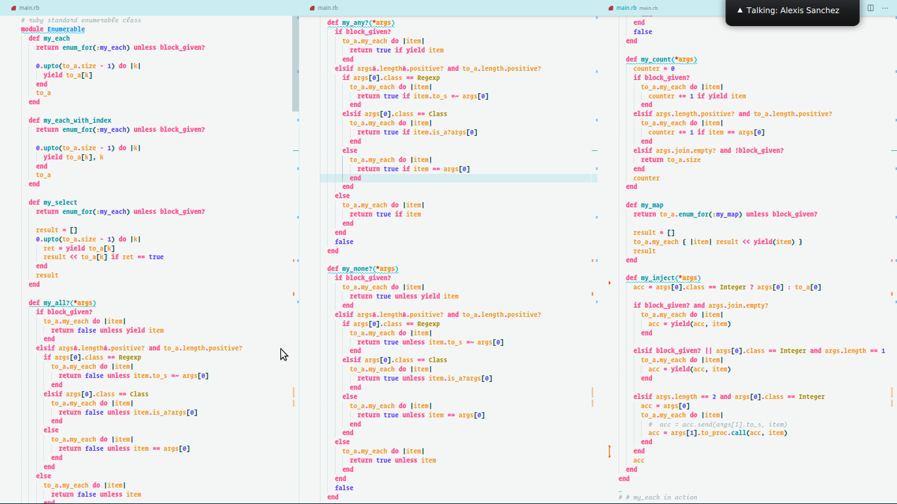

# Recreating the Enumerable  Methods

> This project involves the recreation of the Ruby's major Enumerable methods found in its Enumerable module

Additional description about the project and its features.
 >The code base is pretty straight forward as it involves adding custom methods into the Ruby's enumerable module.  Whats follows is a glimpse of the recreated methods and its Ruby's equivalent method. All the recreated methods are prefixed with "my_" to to avoid conflicts with the original Ruby methods.

 | Original Method  | Recreated Method |
| ------------- | ------------- |
| each  | my_each  |
| each_with_index | my_each_with_index  |
| map | my_inject   |
| all?  | my_all?  |
| map  | my_map  |
| any?  | my_any?  |
| none? | My_none?  |
| count  | my_count  |
| select  | my_select  |

## Built With

- Ruby,
- Vscode

## Getting Started

**Clone this repo to get a local copy of the  project locally.**
**Modify this file to match your test cases**

To get a local copy up and running follow these simple example steps.

### Prerequisites
- Ensure that you have ruby installed -- check out the official documention
- Text Editor: Visual Studio or sublime text recommended
- Rubocop for linting

### Setup
- Check ruby version after installation.
- Open the project folder with vscode.

### Install
- Run bundle install to install all the missing project dependencies.
- gem install to install rubocop for linting purposes

### Usage
- execute the main.rb file by running "ruby main.rb".
- Uncomment the test cases according to the method you want to test.
- Open vscode terminal
- You should see the output from the console.

## Authors

👤 **Cyrus Kiprop**

- Github: [Cyrus-Kiprop](https://github.com/Cyrus-Kiprop)
- Twitter: [@kipropJS](https://twitter.com/kipropJS)
- Linkedin: [Cyrus Kiprop](https://www.linkedin.com/in/cyrus-kiprop-ba7320120/)

## 🤝 Contributing

Contributions, issues and feature requests are welcome!

Feel free to check the [issues page](https://github.com/Cyrus-Kiprop/enumerables/issues).

## Show your support

Give a ⭐️ if you like this project!

## Acknowledgments

- eat() sleep() code() repeat()

## 📝 License

This project is [MIT](lic.url) licensed.
